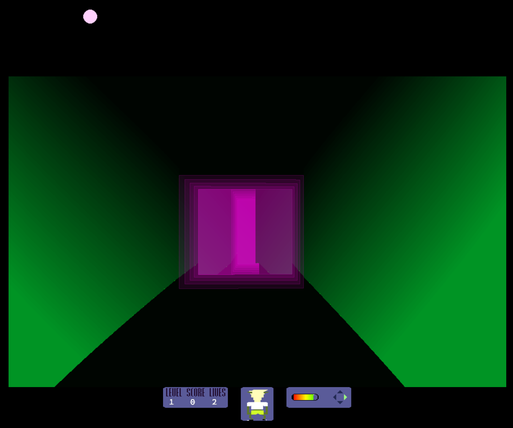
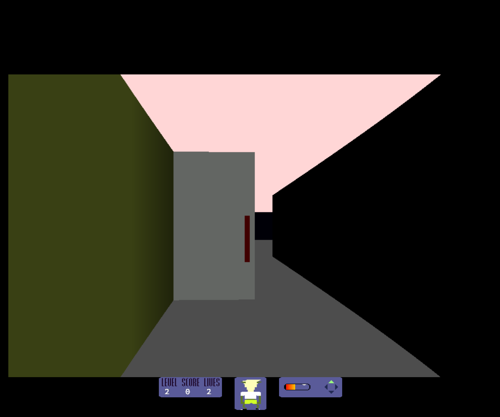
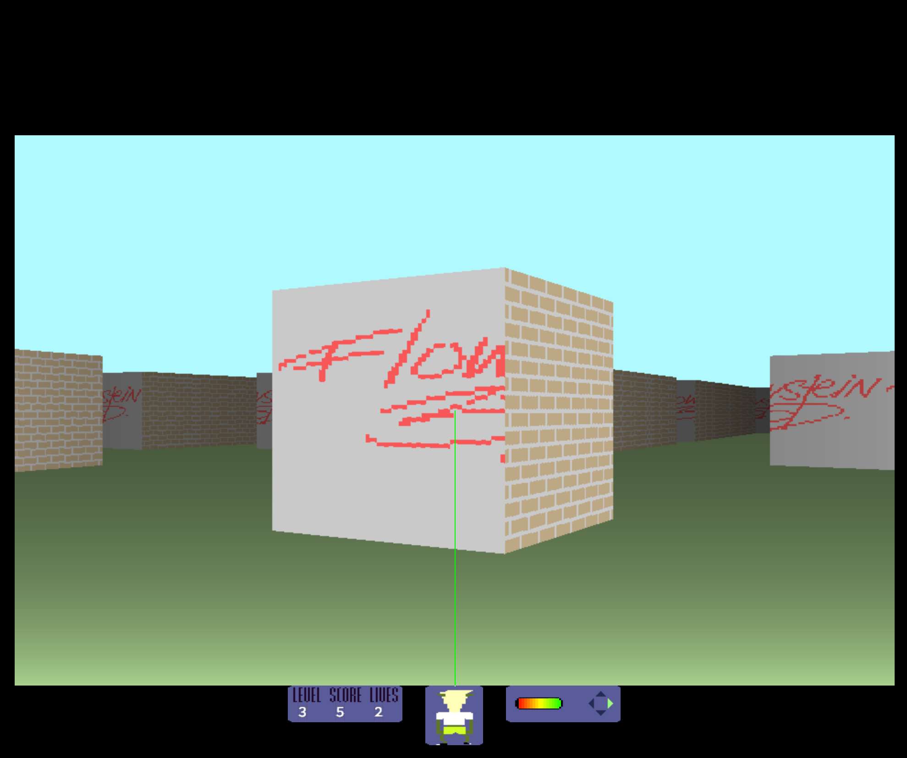
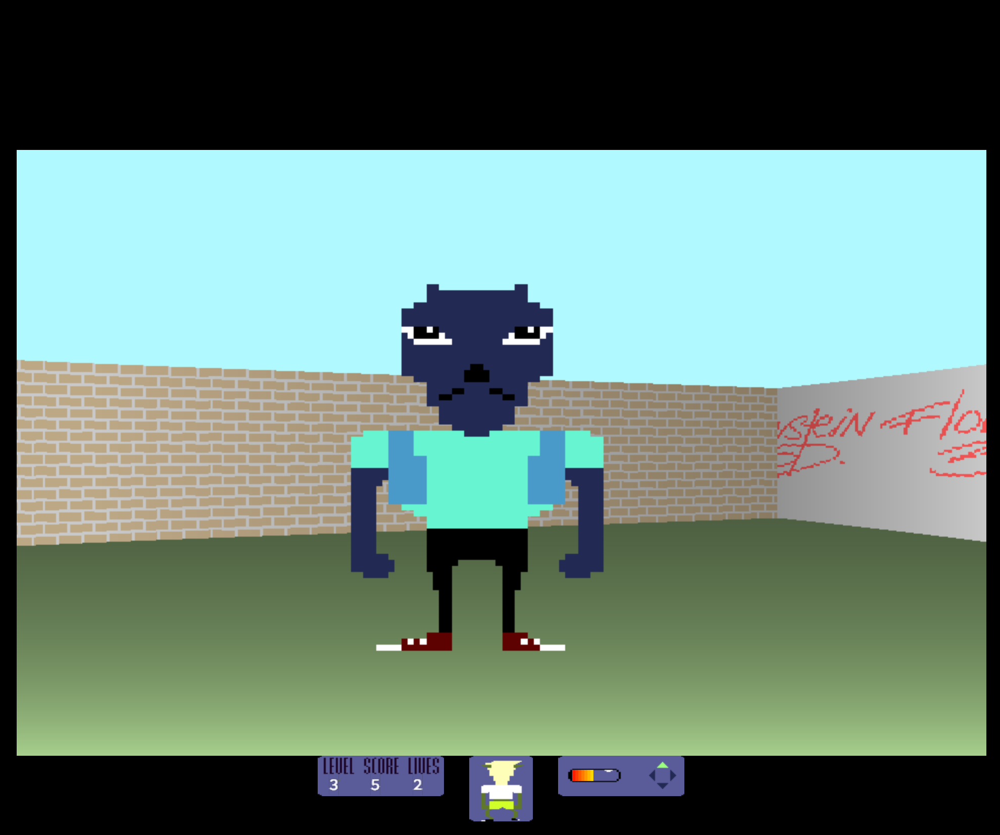
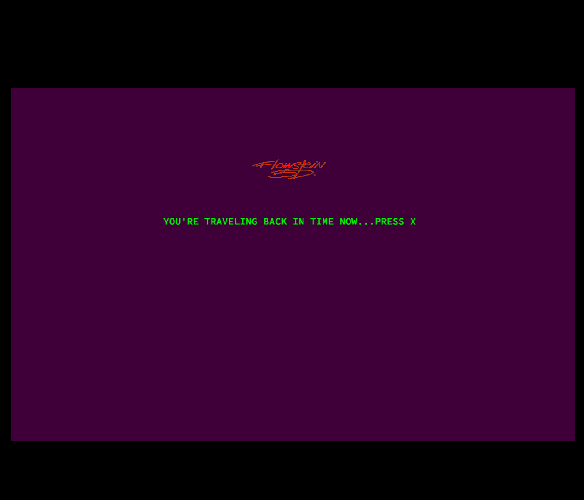

# Wolf3d

- a Hive Helsinki school graphics project Wolf3d:

- a little adventure in a 3D maze created by ray casting.

		make && ./wolf3d maze.wolf 
- move: arrows
- shoot: g
- build walls: f
- build doors (not on the first level): h
- quick switch level: z x

